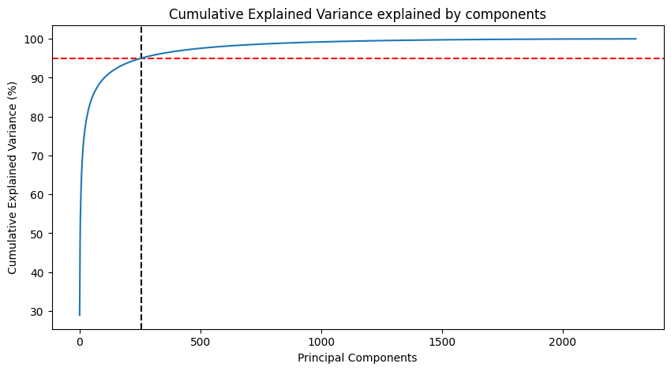
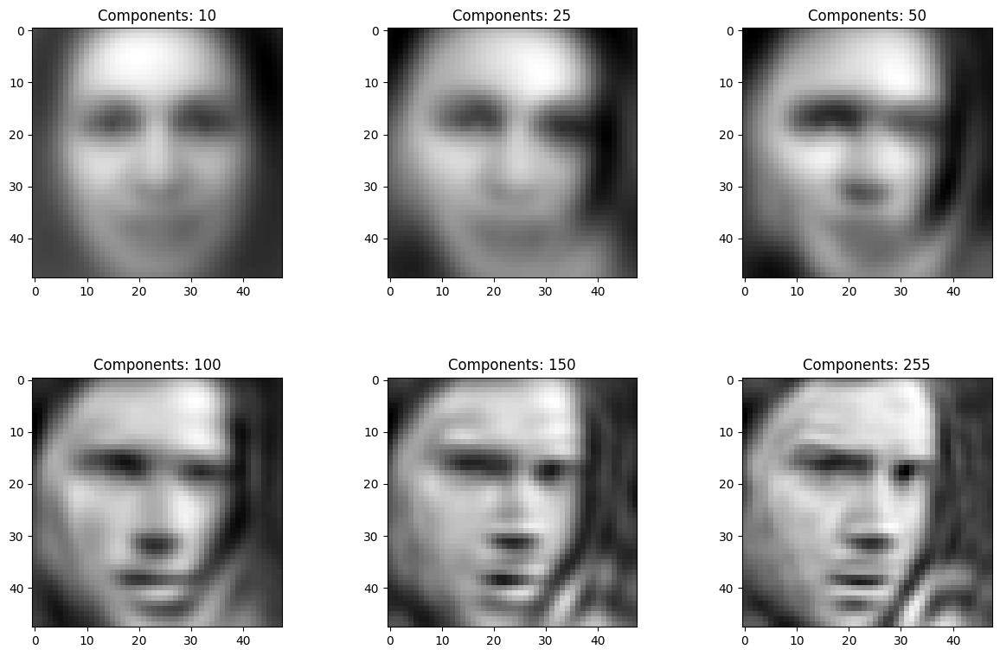
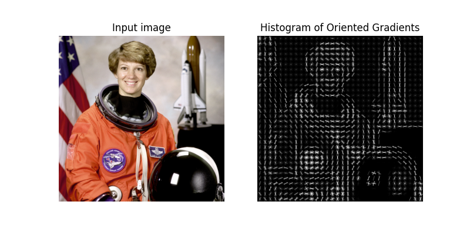
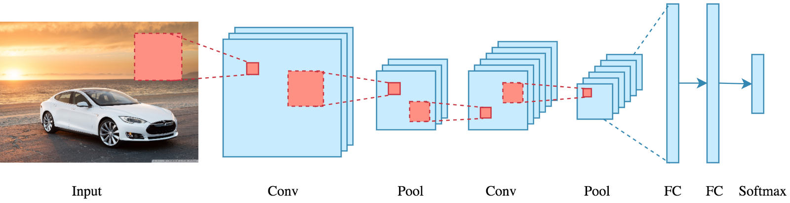
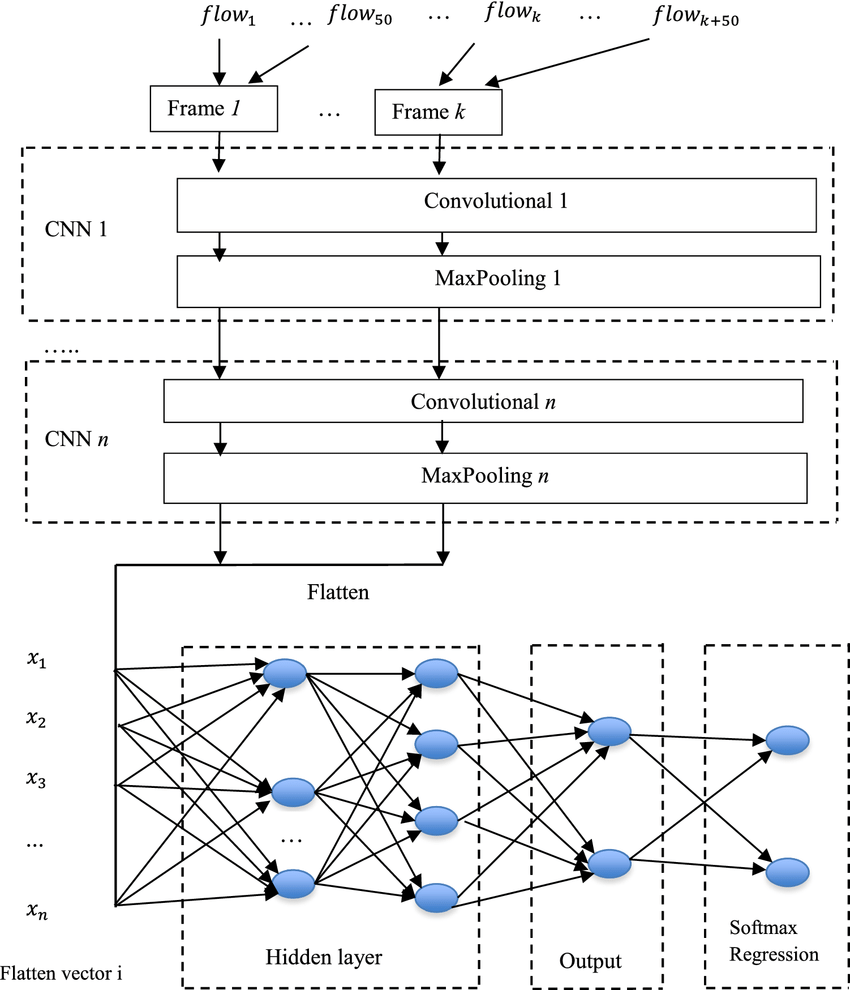
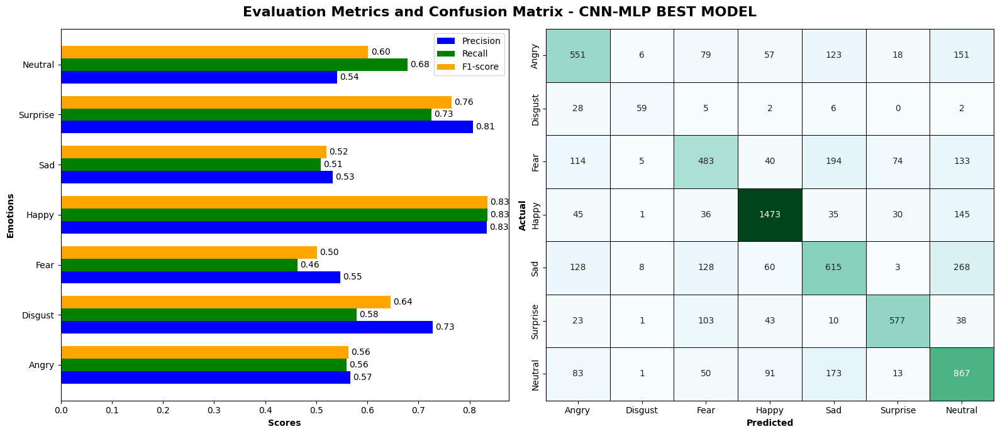

# Mini-Project for Fundamentals of Machine Learning Course


This repository contains the code and data for a mini-project on facial expression recognition using machine learning algorithms.

## 📑 Team members

|No.| Student Name    | Student ID |
| --------| -------- | ------- |
|1|Nguyễn Công Hoài Nam|21280099|
|2|Lê Nguyễn Hoàng Uyên|21280118|
|3|Huỳnh Công Đức|21280124|
|4|Trần Thị Uyên Nhi|21280125|


## 📦 Project Structure

The repository is organized into the following directories:

- **/data**: This directory contains the facial expression dataset and model's file. You'll need to download the dataset and place it here before running the notebooks. (Download link provided below)
- **/notebooks**: This directory contains the Jupyter notebook ```EDA.ipynb```. This notebook guides you through exploratory data analysis (EDA) and classification tasks.

## ⚙️ Usage

This project is designed to be completed in the following steps:

1. **Fork the Project**: Click on the ```Fork``` button on the top right corner of this repository, this will create a copy of the repository in your own GitHub account. Complete the table at the top by entering your team member names.

2. **Download the Dataset**: Download the facial expression dataset and model file from the following [link](https://drive.google.com/drive/folders/1DhafdsTdIfofR6Oty3sNnO206gdnlZS4?usp=drive_link) and place it in the **/data** directory:

3. **Complete the Tasks**: Open the ```notebooks/EDA.ipynb``` notebook in your Jupyter Notebook environment. The notebook is designed to guide you through various tasks, including:
    
    1. **Prerequisite**

    This section provides some basic steps for accessing and visualizing the dataset.

    The data consists of grayscale images of faces, each measuring 48x48 pixels. The faces have been automatically aligned to be roughly centered and occupy a similar area within each image. The task is to categorize each face based on the emotion expressed, assigning it to one of seven categories (0=Angry, 1=Disgust, 2=Fear, 3=Happy, 4=Sad, 5=Surprise, 6=Neutral). The dataset contains a total of 35,887 examples.
    
    | Categorie | Emotion  |
    |-----------|----------|
    | 0         | Angry    |
    | 1         | Disgust  |
    | 2         | Fear     |
    | 3         | Happy    |
    | 4         | Sad      |
    | 5         | Surprise |
    | 6         | Neutral  |

    
    
    2. **Principle Component Analysis**

    
    
    - From 0 to 500 principal components, there is a sharp rise in explained variance initially, indicating that these components capture a significant amount of the data's variance. 

    - The subsequent components only increase the explained variance slightly, making their contribution negligible. 

    - Therefore, choosing a threshold of 95% explained variance is reasonable as it captures most of the data's variance while significantly reducing the dimensionality.

    - Visualizing the first image with different principal components
    

    **3. Image Classification**
    We use two technique to transformed data

    1. **Histograms of Oriented Gradients (HOG)**

    ---

    A popular feature descriptor technique in computer vision and image processing. This descriptor computes the change in pixel values around a point of interest. This change is given by a gradient $\vec{G}$ (change vector) whose magnitude ($m$) and angle ($\theta$) are given by equations 1 and 2:
    
    $$m(x,y) = \sqrt{\vec{G}(x,y)\cdot\vec{G}(x,y)} = \sqrt{\left(G_{x}(x,y)\right)^{2} + \left(G_{y}(x,y)\right)^{2}} \tag{1}$$

    $$\theta(x,y) = \tan^{1} \frac{G_y (x,y)}{G_x (x,y) } \tag{2}$$
    Example:
    <p align="center">
        
    </p>

    
    2. **Principle Component Analysis (PCA)**: dimensionality reduction with explained_variance_

    Using these algorithms we designed a full pipeline:
    
    **PIPELINE**

    | **Steps**                   | **Note**                           |  
    |-----------------------------|------------------------------------|
    | `DescriptorHOG`             | Feature descriptor                 |
    | `PCA`                       | Reduce dimension, keep 90% of data |
    | `Standard Scaler`           | Normalize data                     |
    | `Classification Algorithms` | Model methods                      |
    
    We will tune the hyperparameters of this pipeline with `GridSearchCV` using a parameter grid based on each model to find the best fine-tuned model.

    The classification methods include: `Random Forest`, `Logistic Regression`, `Support Vector Machine (SVM)`, and `multi-layer perceptron (MLP)`.

    We will compare each classification method on 2 datasets:
    - **Original Data**: the original data (without HOG and PCA)
    - **Transformed Data**: full pipeline

    > **Note**: To enhance the model performance, we incorporated an additional method: Convolutional Neural Networks (CNN)

    - When working with large datasets consisting of image pixels, traditional Machine Learning methods tend to be less effective in terms of accuracy and computational efficiency.

    - These methods often struggle with the high dimensionality of image data, leading to longer training times and higher memory usage, especially when limited to using only a CPU.

    - To address these challenges, we decided to train an additional model using a combination of Convolutional Neural Networks (CNN) and Multi-Layer Perceptrons (MLP).

    **Convolutional Neural Network (CNN)**
    CNNs are a class of deep neural networks commonly used to analyze visual imagery. They use a special technique called convolution, which combines two functions to show how one modifies the shape of the other. This makes CNNs particularly effective at detecting patterns in images. In this context, we use CNNs as feature extractors.

    <p align="center">
        
    </p>

    **CNN-MLP Combined**

    The MLP uses the features extracted by the CNN as input. MLPs are a type of artificial neural network composed of multiple layers of nodes, with each layer fully connected to the next one.

    <p align="center">
        
    </p>

4. **Evaluating Classification Performance**
    
    | Model                 | Accuracy | Precision | Recall | F1-score |
    |-----------------------|----------|-----------|--------|----------|
    | Original Logistic Regression | 0.36     | 0.34      | 0.36   | 0.34     |
    | Transformed Logistic Regression | 0.44     | 0.42      | 0.44   | 0.42     |
    | Original Random Forest | 0.47     | 0.50      | 0.47   | 0.45     |
    | Transformed Random Forest | 0.44     | 0.51      | 0.44   | 0.42     |
    | Original SVM           | 0.50     | 0.51      | 0.50   | 0.50     |
    | Transformed SVM        | 0.55     | 0.57      | 0.55   | 0.54     |
    | Original MLP           | 0.45     | 0.45      | 0.45   | 0.45     |
    | Transformed MLP        | 0.49     | 0.49      | 0.49   | 0.49     |
    | CNN-MLP                | 0.64     | 0.65      | 0.64   | 0.64     |

    **Winner Model: CNN-MLP with 64% accuracy**
    <p align="center">
        
    </p>

